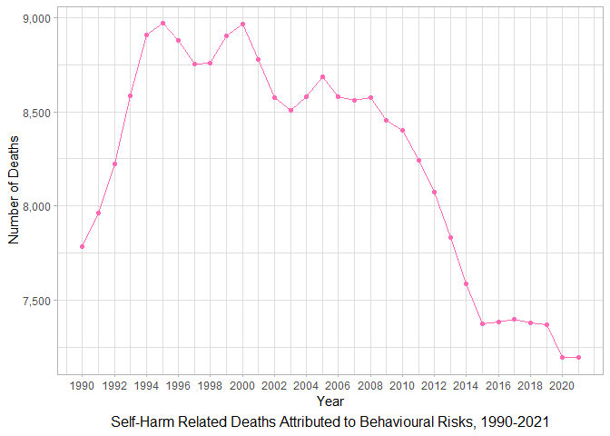

## Research Question

Self-harm is a serious public health concern globally, with prior research (Richardson et al. 2024) finding bullying victimisation, sleep disturbance, mental health disorders and identifying as part of the LGBTQI+ community to be key risk factors for self-harm and suicidality in young people.

This report aims to investigate which are the most significant risk factors associated with self-harm among 20–24 year-olds from 1990 to 2021, and how has their effect on deaths, years of life lost and years lived with disability changed over time?

## Data Set Introduction

The data set analysed in this report is a subset of the [Global Burden of Disease Study 2021](https://vizhub.healthdata.org/gbd-results/) exploring the influence of different risk factors on the number of deaths, years of life lost and years lived with disability due to self-harm in 20-24 year-olds between 1990 and 2021. Each observation contains the years of life lost, years lived with disability and death figures for a particular risk factor in a given year, across both sexes globally.

The data set includes three numerical variables: *Years of Life Lost (YLLs)*, measuring how many years of life were lost due to premature death attributed to self-harm, *Years Lived with Disability (YLDs)*, measuring the severity-weighted number of years individuals lived with health-loss attributed to self-harm, and *Deaths*, measuring the number of deaths attributed to self-harm. It also contains two categorical variables: *Risk Factor*, indicating the attribute or exposure causally related to an increase in self-harm (Global Burden of Disease Study 2021), and *Year*, which spans from 1990 to 2021. All variables are recorded globally for 20–24 year-olds of both sexes.

The variable names within this data set can be observed in Table \@ref(tab:load-the-data-and-clean) below:


``` r
gbd_data <- read.csv("./Data/GBD_data.csv")

# Remove unnecessary columns for metric, cause location, age, sex upper and lower
gbd_data2 <- gbd_data %>% 
  select(measure, rei, year, val)

# Use pivot wider to split the measure column values for deaths, YLL and YLD into their own columns so that each year/risk factor pair has only one observation across all 3 variables
gbd_data_wide <- gbd_data2 %>%
  # Use pivot_wider on the measure column to create new columns for each  
  pivot_wider(names_from = "measure", values_from = "val") %>%
  # Rename columns for clarity and streamlining
  rename(ylds = "YLDs (Years Lived with Disability)",
         ylls = "YLLs (Years of Life Lost)",
         deaths = "Deaths",
         risk_factor = "rei")

# Create a table using kable() and names() to display the variable names in the data set
knitr::kable(names(gbd_data_wide), col.names = "Variable Name", caption = "GBD Data Set Variables") 
```


Table: (\#tab:load-the-data-and-clean)GBD Data Set Variables

|Variable Name |
|:-------------|
|risk_factor   |
|year          |
|deaths        |
|ylds          |
|ylls          |

## Data Set Description

Within the subset of the Global Burden of Disease 2021 data explored in this report, there are **256 observations** across **5 variables**, as described in Table \@ref(tab:load-the-data-and-clean) above.


``` r
# Display the code image
knitr::include_graphics("./Image/Description Screenshot.png")
```


Of the 5 variables, *YLLs*, *YLDs* and *Deaths* are of numeric type, as most values are recorded with decimal points. The *Risk Factor* variable is of character type, representing the name of each risk category. The *Year* variable is stored as an integer but will be treated as a categorical variable when analysing trends and changes in YLLs, YLDs, and Deaths over time.


``` r
# Display first 2 data rows using str() and head () to set observation rows displayed to 2
str(head(gbd_data_wide, 2))
```

```
## tibble [2 × 5] (S3: tbl_df/tbl/data.frame)
##  $ risk_factor: chr [1:2] "High alcohol use" "High alcohol use"
##  $ year       : int [1:2] 1990 1991
##  $ deaths     : num [1:2] 5732 5853
##  $ ylds       : num [1:2] 3198 3233
##  $ ylls       : num [1:2] 387800 395917
```
## Data Summary

The data summary below explores the mean and sum statistics of deaths and YLLs for each risk factor of self-harm from 1990 to 2021, addressing the Section \@ref(research-question) Research Question.


``` r
# Select risk_factor as the categorical variable and ylls and deaths as numeric
summary_data <- gbd_data_wide %>% 
  select(risk_factor, ylls, deaths) %>%
  # Group by risk_factor and create mean and sum statistics
  group_by(risk_factor) %>% 
  summarise(mean_ylls = mean(ylls, na.rm=TRUE), 
            sum_ylls = sum(ylls, na.rm=TRUE), 
            mean_deaths = mean(deaths, na.rm=TRUE), 
            sum_deaths = sum(deaths, na.rm=TRUE))

# Create a table of the summary_data and add caption
knitr::kable(head(summary_data, 10), caption = "Summary Statistics by Risk Factor", digits = 2)
```


Table: (\#tab:create-summary-data)Summary Statistics by Risk Factor

|risk_factor                      |  mean_ylls| sum_ylls| mean_deaths| sum_deaths|
|:--------------------------------|----------:|--------:|-----------:|----------:|
|All risk factors                 |  479554.01| 15345728|     7094.33|  227018.64|
|Behavioral risks                 |  556457.27| 17806633|     8232.21|  263430.57|
|Drug use                         |  162543.71|  5201399|     2404.82|   76954.12|
|Environmental/occupational risks |  -99460.72| -3182743|    -1471.74|  -47095.69|
|High alcohol use                 |  416568.95| 13330206|     6162.73|  197207.32|
|High temperature                 |  133511.72|  4272375|     1973.55|   63153.52|
|Low temperature                  | -237649.44| -7604782|    -3514.42| -112461.53|
|Non-optimal temperature          |  -99460.72| -3182743|    -1471.74|  -47095.69|

In Table \@ref(tab:create-summary-data) above, it can be observed that behavioural risks are associated with the most deaths and YLLs from self-harm, with a total of 263,431 deaths and 17,806,633 YLLs reported from 1990 to 2021. Conversely, environmental and temperature-related risks appear to have **negative** values, suggesting a non-attributable relationship with self-harm-related burdens.


``` r
burdens_over_time <- gbd_data_wide %>%
  # Filter to show burden impacts across all risk factors
  filter(risk_factor == "All risk factors") %>%
  group_by(year) %>%
  # Calculate sum of each burden
  summarise(total_ylls = sum(ylls, na.rm=TRUE), 
            total_deaths = sum(deaths, na.rm=TRUE),
            total_ylds = sum(ylds, na.rm=TRUE)) %>% 
    # Use mutate and lag to calculate the difference between previous year total and current year total and avoid all difference columns being NA (OpenAI 2024)
    mutate(ylls_diff = total_ylls - lag(total_ylls),
           deaths_diff = total_deaths - lag(total_deaths),
           ylds_diff = total_ylds - lag(total_ylds))

# Create a table of the burdens_over_time and add caption
knitr::kable(tail(burdens_over_time, 21), caption = "Summary Statistics of Burdens Over Time", digits = 2)
```


Table: (\#tab:create-table-of-burdens-over-time)Summary Statistics of Burdens Over Time

| year| total_ylls| total_deaths| total_ylds| ylls_diff| deaths_diff| ylds_diff|
|----:|----------:|------------:|----------:|---------:|-----------:|---------:|
| 2001|   506273.8|      7488.02|    4638.28|   1956.43|       28.98|    -24.41|
| 2002|   512067.9|      7574.12|    4618.43|   5794.16|       86.10|    -19.84|
| 2003|   495040.0|      7322.59|    4603.47| -17027.92|     -251.54|    -14.96|
| 2004|   503026.5|      7440.77|    4596.06|   7986.48|      118.18|     -7.42|
| 2005|   511936.2|      7573.02|    4589.76|   8909.70|      132.26|     -6.30|
| 2006|   514605.6|      7612.95|    4588.70|   2669.45|       39.92|     -1.06|
| 2007|   503268.1|      7445.90|    4567.53| -11337.50|     -167.04|    -21.17|
| 2008|   490720.0|      7260.65|    4525.21| -12548.15|     -185.26|    -42.32|
| 2009|   517228.2|      7653.29|    4473.71|  26508.20|      392.64|    -51.51|
| 2010|   517170.0|      7653.30|    4410.83|    -58.13|        0.01|    -62.88|
| 2011|   470129.8|      6957.73|    4323.83| -47040.26|     -695.57|    -87.00|
| 2012|   474852.2|      7027.85|    4213.03|   4722.37|       70.12|   -110.79|
| 2013|   452354.6|      6695.71|    4094.38| -22497.58|     -332.14|   -118.66|
| 2014|   447396.6|      6621.72|    3983.91|  -4958.00|      -73.98|   -110.46|
| 2015|   454101.2|      6720.43|    3885.26|   6704.66|       98.71|    -98.65|
| 2016|   468514.8|      6933.30|    3816.45|  14413.55|      212.86|    -68.81|
| 2017|   461801.6|      6834.17|    3768.42|  -6713.22|      -99.13|    -48.03|
| 2018|   451093.5|      6675.73|    3733.96| -10708.04|     -158.44|    -34.46|
| 2019|   454730.0|      6729.11|    3699.89|   3636.46|       53.38|    -34.07|
| 2020|   437946.9|      6479.78|    3672.94| -16783.05|     -249.32|    -26.95|
| 2021|   437362.6|      6470.71|    3671.69|   -584.36|       -9.08|     -1.25|

## Visualisations

As explored in Table \@ref(tab:create-summary-data) above, behavioural risks such as tobacco use, child malnutrition, low physical activity, unsafe sex, dietary risks, domestic violence and bullying have the highest association with health burdens attributed to self-harm.

The line plot below depicts the trends in self-harm related deaths attributed to behavioural risks over time, from 1990 to 2021.


``` r
# Filter data to just behavioural risk observations
behavioural <- gbd_data_wide %>%
  # Filter to plot only the figures for behavioural risks
  filter(risk_factor == "Behavioral risks")

# Use ggplot to create line plot of the 3 health burdens from 1990-2021
  # Use ggplot to plot year on x axis and deaths, ylls and ylds as y axis values
ggplot(behavioural, aes(x=year, y=deaths)) +
  # Set line plot and colour
  geom_line(color = "Hot Pink") +
  # Use geom_point to add point mappings for each year
  geom_point(color = "Hot Pink") +
  # Scale x axis to ensure readability of year values
  scale_x_continuous(breaks = seq(1990, 2021, 2)) +
  # Scale y axis to remove scientific number formatting
  scale_y_continuous(labels = scales::comma) +
  # Set caption and axis labels
  labs(caption = "Self-Harm Related Deaths Attributed to Behavioural Risks, 1990-2021",
    x = "Year",
    y = "Number of Deaths") +
  # Set different theme
  theme_light() +
  # Make caption centered and larger (OpenAI 2024)
  theme(plot.caption = element_text(hjust = 0.5, size = 12))
```



- *In the line plot above, it can be observed that deaths from self-harm associated with behavioural risks had a positive association with year, gradually rising between 1990 and 1995. Deaths peaked in 1995 before declining and then peaking again in 2000.*
- *Since 2000, there has been a strong negative association between year and the number of self-harm deaths, likely due to the global implementation of various education and assistance programs that help mitigate the impact of behavioural risk factors.*

## Conclusions

The significance of risk factors associated with self-harm among 20-24 year-olds from 1990 to 2021 were analysed using the Global Burden of Disease Study 2021 data.

Behavioural risks returned the highest mean of 556,457.27 and sum of 17,806,633	years of life lost spanning from 1990-2021, and the highest mean of 8,232.21	and sum of 263,430.57 deaths from 1990-2021.

The effect of behavioural risks on deaths has changed over time, reporting a significant decline in total deaths from 2000 onwards.

These findings show that overall, behavioural risks were the most significant factor associated with self-harm in 20-24 year-olds from 1990 to 2021, however, their impact has reduced over time. As the world continues to become more adept in educating and implementing protective barriers for those susceptible to behavioural risks, the volume of health burdens associated with self-harm will continue to decrease. 

## References

Richardson, R., Connell, T., Foster, M., Blamires, J., Smita Keshoor, Moir, C. and Irene Suilan Zeng (2024). *Risk and Protective Factors of Self-harm and Suicidality in Adolescents: An Umbrella Review with Meta-Analysis.* Journal of youth and adolescence, 53(6). doi:<https://doi.org/10.1007/s10964-024-01969-w>.

Global Burden of Disease Collaborative Network (2021). *Global Burden of Disease Study 2021 (GBD 2021) Results.* Seattle, United States: Institute for Health Metrics and Evaluation (IHME). <https://vizhub.healthdata.org/gbd-results/>.

Xie, Y., Allaire, J.J., Grolemund, G. (2023). *R Markdown: The Definitive Guide.* Bookdown Org. <https://bookdown.org/yihui/rmarkdown/>

Xie, Y., Dervieux, C., Riederer, E. (2025). *R Markdown Cookbook.* Bookdown Org. <https://bookdown.org/yihui/rmarkdown-cookbook/>.

Rdocumentation Org (2019). *str: Compactly Display the Structure of an Arbitrary R Object*. Rdocumentation. <https://www.rdocumentation.org/packages/utils/versions/3.6.2/topics/str>.

OpenAI (2024) *ChatGPT* (GPT-4-turbo, May 2024 version)[Large language model]. https://chat.openai.com/
